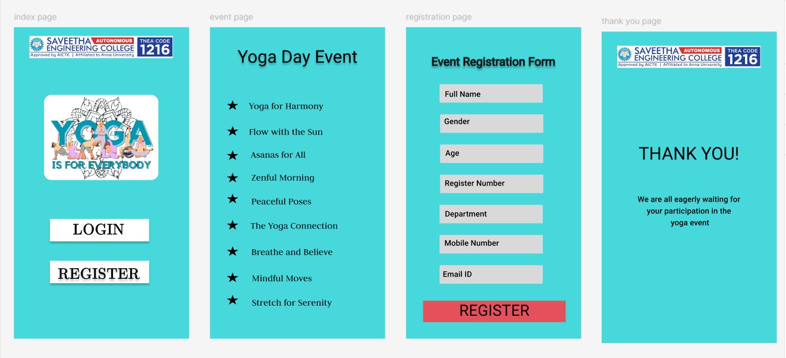

# Ex09 Event Registration Web Application
# Date: 25.11.14
# AIM:
To design, develop and deploy a web application for event registration.

# DESIGN STEPS:
## Step 1:
Create a new frame.

## Step 2:
Select any one preset size of your choice.

## Step 3:
Select the shapes you need.

## Step 4:
Import images as needed.

## Step 5:
Create pages based on your need and link them.

## Step 6:
Validate the HTML and CSS code.

## Step 6:
Publish the website in the given URL.

# DESIGN TOOL:
Figma

# CODE:

home page
```
<style>
    .auth-container {
      background-color: rgba(70, 216, 219, 1);
      display: flex;
      max-width: 360px;
      flex-direction: column;
      overflow: hidden;
      align-items: center;
      padding: 18px 32px 114px;
    }
    
    .logo-primary {
      aspect-ratio: 6.41;
      object-fit: contain;
      object-position: center;
      width: 100%;
      align-self: stretch;
    }
    
    .logo-secondary {
      aspect-ratio: 1.34;
      object-fit: contain;
      object-position: center;
      width: 235px;
      border-radius: 15px;
      margin-top: 75px;
      max-width: 100%;
    }
    
    .auth-button {
      background-color: rgba(255, 255, 255, 1);
      box-shadow: 0 4px 4px rgba(0, 0, 0, 0.25);
      width: 204px;
      max-width: 100%;
      border: 1px solid rgba(0, 0, 0, 1);
      font: 500 32px jsMath-cmr10, sans-serif;
      color: rgba(0, 0, 0, 1);
      text-align: center;
      white-space: nowrap;
    }
    
    .login-button {
      margin-top: 80px;
      padding: 6px 50px 16px;
    }
    
    .register-button {
      margin-top: 40px;
      padding: 11px 2px;
      text-shadow: 0 4px 4px rgba(0, 0, 0, 0.25);
      z-index: 10;
    }
    </style>
    
    <div class="auth-container">
      
      
      <button class="auth-button login-button" tabindex="0">LOGIN</button>
      <button class="auth-button register-button" tabindex="0">REGISTER</button>
    </div>
```
event page
```
<style>
    .yoga-events-container {
      background-color: rgba(70, 216, 219, 1);
      display: flex;
      max-width: 360px;
      flex-direction: column;
      overflow: hidden;
      align-items: start;
      padding: 28px 25px 70px;
    }
    
    .main-title {
      color: #000;
      text-align: center;
      text-shadow: 0px 4px 4px rgba(0, 0, 0, 0.25);
      letter-spacing: var(--Display-Medium-Tracking, 0px);
      align-self: stretch;
      font: 400 var(--Display-Small-Size, 36px) / var(--Display-Small-Line-Height, 44px) var(--Display-Small-Font, Roboto);
    }
    
    .event-item {
      display: flex;
      gap: 22px;
      margin: 33px 0 0 10px;
      color: rgba(0, 0, 0, 1);
      font: 400 20px Judson, sans-serif;
    }
    
    .event-item:first-of-type {
      margin-top: 56px;
    }
    
    .event-icon {
      aspect-ratio: 1.15;
      object-fit: contain;
      object-position: center;
      width: 23px;
    }
    
    .event-title {
      flex-basis: auto;
      margin: auto 0;
    }
    
    .visually-hidden {
      position: absolute;
      width: 1px;
      height: 1px;
      padding: 0;
      margin: -1px;
      overflow: hidden;
      clip: rect(0, 0, 0, 0);
      border: 0;
    }
    </style>
    
    <div class="yoga-events-container">
      <h1 class="main-title">Yoga Day Event</h1>
      
      <div class="event-item">
        
        <span class="event-title">Yoga for Harmony</span>
      </div>
    
      <div class="event-item">
        
        <span class="event-title">Flow with the Sun</span>
      </div>
    
      <div class="event-item">
        
        <span class="event-title">Asanas for All</span>
      </div>
    
      <div class="event-item">
        
        <span class="event-title">Zenful Morning</span>
      </div>
    
      <div class="event-item">
        
        <span class="event-title">Peaceful Poses</span>
      </div>
    
      <div class="event-item">
        
        <span class="event-title">The Yoga Connection</span>
      </div>
    
      <div class="event-item">
        
        <span class="event-title">Breathe and Believe</span>
      </div>
    
      <div class="event-item">
        
        <span class="event-title">Mindful Moves</span>
      </div>
    
      <div class="event-item">
        
        <span class="event-title">Stretch for Serenity</span>
      </div>
    </div>

```
registration page
```
<style>
.registration-container {
  background-color: rgba(70, 216, 219, 1);
  display: flex;
  max-width: 360px;
  flex-direction: column;
  overflow: hidden;
  align-items: center;
  margin: 0 auto;
  padding: 55px 35px 34px;
}

.registration-title {
  text-shadow: 0px 4px 4px rgba(0, 0, 0, 0.25);
  -webkit-text-stroke: 1px rgba(0, 0, 0, 0.5);
  letter-spacing: var(--Headline-Small-Tracking, 0px);
  font: 400 var(--Headline-Small-Size, 24px)/var(--Headline-Small-Line-Height, 32px) var(--Headline-Small-Font, Roboto);
  align-self: flex-start;
  border: 1px solid rgba(0, 0, 0, 0.5);
}

.form-field {
  background-color: rgba(217, 217, 217, 1);
  margin-top: 24px;
  width: 212px;
  max-width: 100%;
  padding: 8px 12px;
  border: none;
  font: 500 16px/24px Roboto;
  letter-spacing: 0.15px;
}

.submit-button {
  background-color: rgba(229, 81, 91, 1);
  width: 100%;
  margin-top: 35px;
  padding: 10px;
  border: none;
  color: #000;
  font: 400 32px/40px Roboto;
  letter-spacing: var(--Headline-Large-Tracking, 0px);
  cursor: pointer;
}

.visually-hidden {
  position: absolute;
  width: 1px;
  height: 1px;
  padding: 0;
  margin: -1px;
  overflow: hidden;
  clip: rect(0, 0, 0, 0);
  border: 0;
}
</style>

<form class="registration-container" action="#" method="POST">
  <h1 class="registration-title">Event Registration Form</h1>
  
  <label for="fullName" class="visually-hidden">Full Name</label>
  <input type="text" id="fullName" name="fullName" class="form-field" placeholder="Full Name" required>
  
  <label for="gender" class="visually-hidden">Gender</label>
  <select id="gender" name="gender" class="form-field" required>
    <option value="">Select Gender</option>
    <option value="male">Male</option>
    <option value="female">Female</option>
    <option value="other">Other</option>
  </select>
  
  <label for="age" class="visually-hidden">Age</label>
  <input type="number" id="age" name="age" class="form-field" placeholder="Age" required>
  
  <label for="registerNumber" class="visually-hidden">Register Number</label>
  <input type="text" id="registerNumber" name="registerNumber" class="form-field" placeholder="Register Number" required>
  
  <label for="department" class="visually-hidden">Department</label>
  <select id="department" name="department" class="form-field" required>
    <option value="">Select Department</option>
    <option value="cs">Computer Science</option>
    <option value="it">Information Technology</option>
    <option value="ec">Electronics</option>
    <option value="me">Mechanical</option>
  </select>
  
  <label for="mobileNumber" class="visually-hidden">Mobile Number</label>
  <input type="tel" id="mobileNumber" name="mobileNumber" class="form-field" placeholder="Mobile Number" pattern="[0-9]{10}" required>
  
  <label for="emailId" class="visually-hidden">Email ID</label>
  <input type="email" id="emailId" name="emailId" class="form-field" placeholder="Email ID" required>
  
  <button type="submit" class="submit-button">REGISTER</button>
</form>
```
thank you page
```
<style>
.thank-you-container {
  background-color: rgba(70, 216, 219, 1);
  display: flex;
  max-width: 360px;
  flex-direction: column;
  overflow: hidden;
  align-items: center;
  color: #000;
  text-align: center;
  padding: 29px 32px 243px;
}

.header-image {
  aspect-ratio: 6.41;
  object-fit: contain;
  object-position: center;
  width: 100%;
  align-self: stretch;
}

.title {
  letter-spacing: var(--Display-Medium-Tracking, 0px);
  margin-top: 154px;
  font: 400 var(--Display-Small-Size, 36px) / var(--Display-Small-Line-Height, 44px) var(--Display-Small-Font, Roboto);
}

.message {
  letter-spacing: var(--Title-Medium-Tracking, 0.15px);
  margin-top: 78px;
  font: 500 var(--Title-Medium-Size, 16px) / var(--Title-Medium-Line-Height, 24px) var(--Title-Medium-Font, Roboto);
}

.visually-hidden {
  position: absolute;
  width: 1px;
  height: 1px;
  padding: 0;
  margin: -1px;
  overflow: hidden;
  clip: rect(0, 0, 0, 0);
  border: 0;
}
</style>

<div class="thank-you-container">
  
  <h1 class="title">THANK YOU!</h1>
  <p class="message">
    We are all eagerly waiting for your participation in the
    <br />
    yoga event
  </p>
</div>
```

# OUTPUT:



# RESULT:
The program to design, develop and deploy a web application for event registration is completed successfully.
